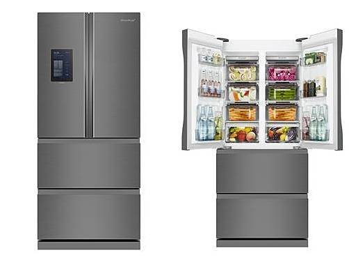

# 기술문서작성 사물인터넷 보고서

> YA 8조 사물인터넷 20132147 김현욱, 20192696 이정석

## 사물 인터넷이란?

사물 인터넷(Internet of Things, IoT)은 각종 사물에 센서와 통신 기능을 내장하여 인터넷에 연결하는 기술. 즉, 무선 통신을 통해 각종 사물을 연결하는 기술을 의미한다.
인터넷으로 연결된 사물들이 데이터를 주고받아 스스로 분석하고 학습한 정보를 사용자에게 제공하거나 사용자가 이를 원격 조정할 수 있는 인공지능 기술이다.

------

## IoT 적용 사례

4차 산업혁명 사물인터넷 적용분야를 생각해 보면 스마트 팜(Smart Farm), 스마트 홈(Smart Home), 스마트 팩토리(Smart Factory), 스마트 시티(Smart City) 등으로 분류할 수 있다.

대유위니아, LCD 화면 달린 'IoT 김치냉장고' 딤채 출시 (05/30)

 

10.1인치 크기의 LCD 화면에 메모장 기능이 있어 어떤 제품을 언제부터 보관했는지 등을 기록할 수 있는 것은 물론 원하는 시점에 알람 설정도 할 수 있게 했다.

또 레시피 애플리케이션을 보면서 요리할 수 있고, 내장된 인터넷 서비스를 통해 딤채 식품 사이트에서 김치나 쌀 등 식품 주문도 가능하다.

이밖에 음악 감상, 동영상 시청도 할 수 있고, 다양한 생활정보도 LCD 화면을 통해 실시간으로 확인할 수 있다.  

------

### IoT 기술의 전망

<https://www.youtube.com/watch?v=SH0cshYP8S4>

동영상 참조

------

## IoT의 단점

- #### 해킹의 취약성

시만텍은 IoT기술이 보편화함에 따라 발생할 수 있는 해킹 가능성에 대해 지적하였다. 다수의 IoT 기기의 기반인 리눅스 운영체제가 기기에서 올바른 보안을 갖추지 못하거나 적절한 업데이트가 이루어지지 않을 경우 리눅스 웜에 의해 해킹당할 위험이 존재한다. 실제로 IoT 환경에서 보안 취약점을 악용해 사생활을 침해한 사례도 있다. 미국에서 아기 모니터링 카메라인 SecurView를 생산, 판매하는 회사인 TRENDnet은 자사 제품에 올바른 보안 시스템을 구축하지 못한 채 이를 유통했다. 결과적으로 이 제품은 700여 가구의 가정 내부 영상을 해커들에게 유출했고 TRENDnet은 연방거래위원회로부터 제재를 받게 되었다.

IoT가 대중화됨에 따라 IoT 전체 시스템에 대한 많은 이슈가 존재한다. 이들은 각 계층의 해결책을 단순히 나열함으로써 해결되지 않는다. 다양한 응용 분야에서 서로 다른 보안 이슈가 존재한다. 예를 들어, 지능형 운송과 지능형 진료는 데이터 보안이 매우 중요하다. 그러나 지능형 도시 관리나 스마트 환경(smart green)은 인증이 더 중요하다. 최상의 보안을 위해서는 서로 다른 응용 시스템에서의 차별적인 중요도를 고려해야 한다. 또한, 한 계층의 보안 문제만 해결하는 것이 아니라, 여러 계층에 대한 협력적 해결 방법을 개발하고 계층 교차적인(cross-layer) 접근을 해야 한다. 이를 위해 자율적이고 이질적인 시스템 통합 모델을 구축하는 기술이 필요하다. 또한, 대규모 이질적 네트워크를 구축하기 위하여 계층 교차적인 통합 기술을 개발할 필요가 있다.

- #### 표준의 부족

IoT 기술 발달에 따른 부작용의 또 다른 하나는 표준의 부족이다. IoT 기술이 발달될수록
이 표준의 부족에 따른 경쟁은 계속해서 과열될 것이라고 한다.IoT는 프로토콜 즉, 컴퓨터 간에 정보를 주고받을 때 사용하는 일정 규칙을 기반으로 하여서 사물들에게 이 IoT 기술을 접목한다. 프로토콜의 간단한 예는 현재 우리가 URL에 사용하는 https이다. 이러한
기준이 필요한데 모든 사물에 인공 지능 기술을 넣게 되면 https 하나로는 기술의 발달이 일어날 수
없다. 더 많은 기준과 표준이 마련되어 그에 따라 이 IoT 기술은
행해져야 한다. 또한, 모든 사물에 이 IoT 기술을 접목하기 때문에 오픈 네트워크를 바탕으로 실행된다. IoT라는
이 신기술이 발달하는 동안에는 표준에 따른 회사 간 또는 나라 간의 경쟁은 계속해서 치열해지는 부정적인 영향을 낳게 된다는 것이다. 그 예로, 현재 Google과 Nest가 Nest Platform을 만들기 위해 활발히 연구를 진행
중이고 이 외에도 Cisco, Qualcomm, IBM, BroadCam, Samsung, Microsoft 등이
이 표준을 만들기 위해 연구를 활발히 진행 중이다. 자세한 사례를 하나 더 들자면, Qualcomm이라는 회사가 AllJoyn이라는 IoT를 위한 새로운 프로토콜을 만들었고 이에 대항하여 Google은 Thread라는 프로토콜을 만들었다. 또한, intel은 오픈 상호연결 컨소시엄이라는 협력단을 만드는 등의 프로토콜 전쟁이 시작되고 있다. 

- #### 환경의 영향

현재 Electronic waste라 불리는
e-waste의 폭발적 증가에 관련한 문제의 발생이 늘어나고 있다. 급격하게 증가하는 소형
전기 부품이 증가하는 e-waste에 기여하고 있다. 모든
사물에 전기 전자의 부품이나 정보가 적용되기 때문에 그에 따른 쓰레기의 발생은 환경에 많은 영향을 끼칠 것이라는 것이다. 이 환경적 영향을 최소화하기 위해선 사물의 효율과 내구성을 높이는 것이 매우 중요하다고 한다. 정보가 전달되고 저장되는 과정이 효율적이게 최소화되어야 한다는 것이다.

------

